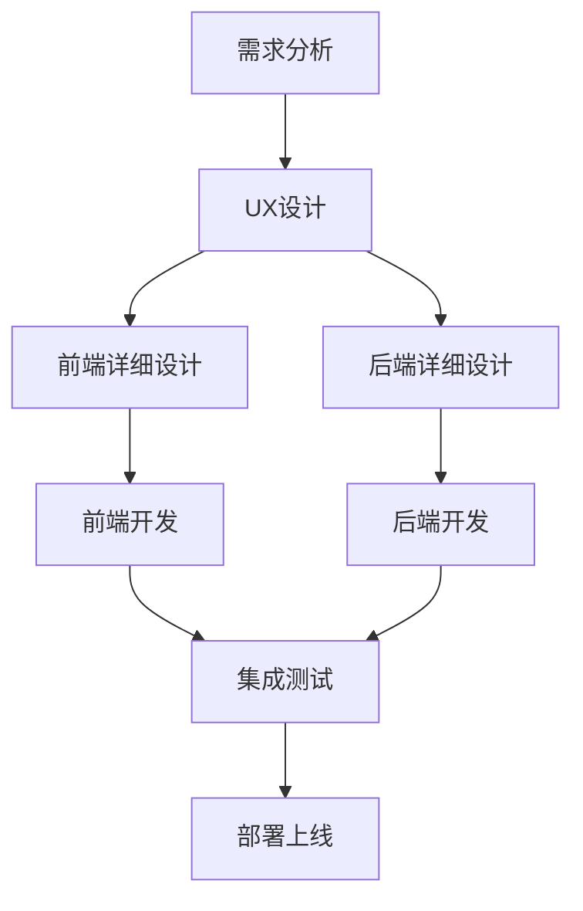

# 批处理系统审核管理平台

  
  <h3>批处理项目高效审核与批量处理平台</h3>

## 📑 系统概述

批处理审核系统是专为设计工作流设计的高效审核平台，支持批量项目的创建、审批、反馈和执行全流程。系统遵循 Apple Human Interface Guidelines，提供简洁高效的用户界面和流畅的交互体验。

### 核心功能

- **多级审核流程** - 可配置的审核流程，支持串行、并行和条件审核路径
- **标注与反馈** - 直观的图形标注工具，支持精准反馈
- **飞书集成** - 与企业现有工作流的无缝集成
- **批量操作** - 高效处理大量同类项目
- **实时通知** - 审核状态变更的及时推送
- **数据统计** - 全面的审核绩效分析

## 🧭 文档导航

### 📱 原型与UX设计

- [UX 设计概览](前端/概要设计/概要设计.md)
- [设计系统概要](前端/概要设计/设计系统概要设计.md)

### 🎨 前端设计

- [前端系统概要设计](前端/概要设计/前端系统概要设计.md)
- **详细设计**
  - [批处理系统审核管理](前端/详细设计/批处理系统审核管理.md)
  - [模板库页面设计](前端/详细设计/模板库页面设计.md)
  - [批处理中心页面设计](前端/详细设计/批处理中心页面设计.md)
  - [素材库页面设计](前端/详细设计/素材库页面设计.md)
  - [画布模块详细设计](前端/详细设计/画布模块详细设计.md)

### 🔧 后端设计

- [审核系统架构概要设计](后端/概要设计/审核系统架构概要设计.md)
- **服务详细设计**
  - [审核服务设计](后端/详细设计/服务设计/审核服务设计.md)
- **接口文档**
  - [审核服务接口文档](后端/详细设计/接口文档/审核服务接口文档.md)
- **数据库设计**
  - [审核系统数据库设计](后端/详细设计/数据库设计/审核系统数据库设计.md)
- **部署文档**
  - [审核系统部署架构](后端/部署文档/审核系统部署架构.md)

## 🔄 实现路径

## 📦 技术栈

### 前端
- React + TypeScript
- Ant Design + 自定义设计系统
- Canvas API (标注功能)
- WebSocket (实时通知)

### 后端
- .NET 7 / ASP.NET Core
- Entity Framework Core + SQL Server
- MongoDB (复杂标注数据)
- Redis (缓存)
- RabbitMQ (消息队列)
- Docker + Kubernetes (部署)

## 📸 屏幕预览

  
  
<i>审核中心 - 批处理项目一览</i>

  
  
  
<i>审核详情 - 批量审核与标注</i>

## 👥 项目团队

- **UX/UI设计** - 设计团队
- **前端开发** - 前端开发团队
- **后端开发** - 后端开发团队
- **DevOps** - 运维团队

## 📅 里程碑

- **设计阶段** - 2023.Q2
- **开发阶段** - 2023.Q3
- **测试阶段** - 2023.Q4
- **上线阶段** - 2024.Q1 