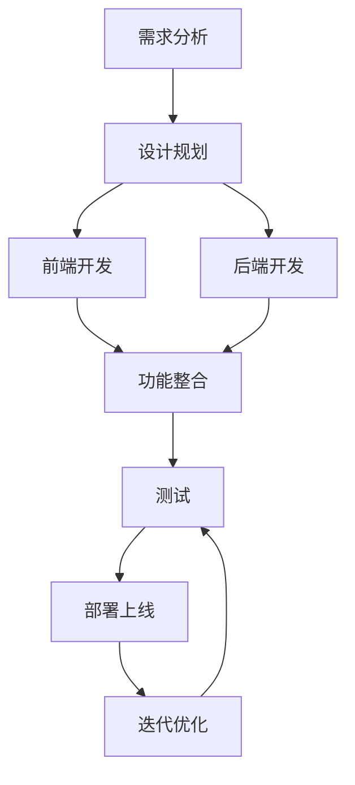

# CreativePro Studio 文档中心

  <h3>且初美妆电商团队视觉内容创作平台</h3>
  
提高设计效率 | 确保设计一致性 | 简化复杂工作 | 促进团队协作

## 📑 文档导航

### 📋 [产品概述](产品概述/README.md)
- [产品愿景](产品概述/产品愿景.md)
- [设计原则](产品概述/设计原则.md)
- [目标用户](产品概述/目标用户.md)
- [核心价值](产品概述/核心价值.md)

### 🏗️ [系统架构](系统架构/README.md)
- [整体架构设计](系统架构/整体架构设计.md)
- [前后端分离原则](系统架构/前后端分离原则.md)
- [技术选型](系统架构/技术选型.md)

### 🎨 [前端文档](前端文档/README.md)
- [概要设计](前端文档/概要设计/README.md)
- [详细设计](前端文档/详细设计/README.md)
  - [素材库模块](前端文档/详细设计/素材库模块/README.md)
  - [母版库模块](前端文档/详细设计/母版库模块/README.md)
  - [画布系统](前端文档/详细设计/画布系统/README.md)
  - [批量处理模块](前端文档/详细设计/批量处理模块/README.md)
  - [导出系统](前端文档/详细设计/导出系统/README.md)
- [组件库](前端文档/组件库/README.md)

### 🔧 [后端文档](后端文档/README.md)
- [概要设计](后端文档/概要设计/README.md)
- [详细设计](后端文档/详细设计/README.md)
- [数据库设计](后端文档/数据库设计/README.md)
- [API文档](后端文档/API文档/README.md)

### 🖥️ [用户界面](用户界面/README.md)
- [UI规范](用户界面/UI规范/README.md)
- [界面设计](用户界面/界面设计/README.md)

### ⚙️ [功能实现](功能实现/README.md)
- [素材管理功能](功能实现/素材管理功能.md)
- [母版模板功能](功能实现/母版模板功能.md)
- [批量处理功能](功能实现/批量处理功能.md)
- [精确控制功能](功能实现/精确控制功能.md)
- [导出系统功能](功能实现/导出系统功能.md)

### 🧪 [测试与部署](测试与部署/README.md)
- [测试计划](测试与部署/测试计划/README.md)
- [部署方案](测试与部署/部署方案/README.md)

### 📅 [项目管理](项目管理/README.md)
- [开发路线图](项目管理/开发路线图.md)
- [优先级矩阵](项目管理/优先级矩阵.md)
- [风险管理](项目管理/风险管理.md)
- [迭代计划](项目管理/迭代计划.md)

## 🔄 开发流程

## 📦 技术栈

### 前端
- React + Canvas/WebGL
- Redux状态管理
- 自定义UI组件库

### 后端
- RESTful API
- 关系型数据库 + 对象存储
- OAuth2认证机制

## 📋 优先级开发顺序

1. 素材库系统 (P0)
2. 母版库系统 (P0)
3. 画布系统 (P0)
4. 批量处理系统 (P0)
5. 精确元素控制 (P0)
6. 批量导出功能 (P1)

## 👥 文档维护

- 文档版本：v1.0
- 最后更新：2025年5月1日
- 维护责任人：产品与开发团队 