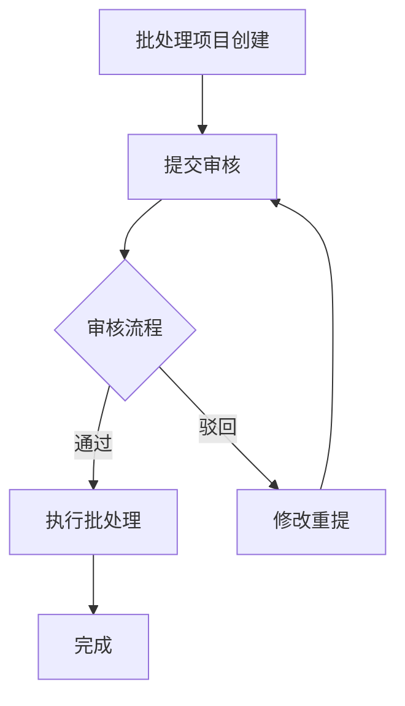

# 批处理项目审核管理系统设计

## 系统概述

批处理项目审核管理系统作为批量处理工作流中的关键环节，提供了项目审核、反馈、修改和确认的完整闭环。系统设计遵循 Apple Human Interface Guidelines，确保界面简洁高效，交互直观流畅。

## 审核流程设计



## 界面设计

### 审核中心

- **设计原则**：清晰的视觉层级，简洁直观的操作流程，一致的交互模式
- **布局结构**：遵循卡片式设计，信息分级展示，减少认知负荷
- **状态表达**：使用视觉差异化表达不同审核状态（待审核、审核中、已通过、已驳回）

#### 详细布局

```
┌────────────────────────────────────────────────────────────────────┐
│ 导航栏                                              用户信息区域     │
├────────────────────────────────────────────────────────────────────┤
│ ┌──────────┐ ┌─────────────────────────────────────────────────┐   │
│ │          │ │ 审核状态过滤 | 搜索框 | 排序选项 | + 创建审核任务 │   │
│ │ 侧边导航  │ ├─────────────────────────────────────────────────┤   │
│ │          │ │                                                 │   │
│ │ - 批处理  │ │                                                 │   │
│ │ - 审核中心 │ │                                                 │   │
│ │ - 模板库  │ │              审核任务卡片网格                    │   │
│ │ - 素材库  │ │                                                 │   │
│ │ - 统计    │ │                                                 │   │
│ │          │ │                                                 │   │
│ └──────────┘ └─────────────────────────────────────────────────┘   │
│                                                                    │
│ ┌────────────────────────────────────────────────────────────────┐ │
│ │                   审核统计与性能指标区域                         │ │
│ └────────────────────────────────────────────────────────────────┘ │
└────────────────────────────────────────────────────────────────────┘
```

### 审核详情页

- **信息展示**：项目信息、素材预览、审核记录时间线
- **操作区域**：审核操作按钮（通过/驳回）、反馈输入区域
- **交互设计**：
  - 批量/单个审核切换
  - 历史版本对比查看
  - 审核评论与标注

#### 详细布局

```
┌────────────────────────────────────────────────────────────────────┐
│ 返回审核中心                  审核详情：[项目名称]      审核人：[姓名] │
├───────────────────┬────────────────────────────────────────────────┤
│                   │                                                │
│                   │  ┌──────────────────────────────────────────┐  │
│  项目信息面板      │  │                                          │  │
│  - 项目名称        │  │                                          │  │
│  - 创建时间        │  │            预览区域                       │  │
│  - 创建人          │  │                                          │  │
│  - 项目类型        │  │                                          │  │
│  - 待处理数量      │  │                                          │  │
│  - 当前状态        │  └──────────────────────────────────────────┘  │
│                   │                                                │
│  审核历史时间线    │  ┌──────────────────────────────────────────┐  │
│  ● 提交审核        │  │ 批量预览导航                             │  │
│  │                │  │ ┌───┐ ┌───┐ ┌───┐ ┌───┐ ┌───┐ ┌───┐ More │  │
│  ● 驳回修改        │  │ │ 1 │ │ 2 │ │ 3 │ │ 4 │ │ 5 │ │ 6 │ ►    │  │
│  │ "图片分辨率不足" │  │ └───┘ └───┘ └───┘ └───┘ └───┘ └───┘      │  │
│  │                │  └──────────────────────────────────────────┘  │
│  ● 重新提交        │                                                │
│  │                │  ┌──────────────────────────────────────────┐  │
│  ○ 当前审核中      │  │ 审核工具栏                               │  │
│                   │  │ [添加标注] [对比历史版本] [展开全部]       │  │
│                   │  └──────────────────────────────────────────┘  │
│                   │                                                │
│                   │  ┌──────────────────────────────────────────┐  │
│                   │  │ 审核反馈                                  │  │
│                   │  │ ○ 通过    ○ 驳回                          │  │
│                   │  │                                          │  │
│                   │  │ 反馈意见：                                │  │
│                   │  │ ┌──────────────────────────────────────┐ │  │
│                   │  │ │                                      │ │  │
│                   │  │ └──────────────────────────────────────┘ │  │
│                   │  │                                          │  │
│                   │  │ [取消]                      [提交审核结果] │  │
│                   │  └──────────────────────────────────────────┘  │
└───────────────────┴────────────────────────────────────────────────┘
```

## 核心组件

### 审核卡片

```
┌────────────────────────────┐
│ [状态标签]    项目名称     │
├────────────────────────────┤
│                            │
│        预览缩略图          │
│                            │
├────────────────────────────┤
│ 提交时间:  2023-05-20      │
│ 提交人:    张三            │
│ 待处理数量: 120 张         │
├────────────────────────────┤
│  [查看详情]   [快速审核]   │
└────────────────────────────┘
```

#### 视觉规范
- **卡片背景**：`var(--white)`
- **边框**：`1px solid var(--gray-200)`
- **圆角**：`12px`
- **阴影**：`0 2px 8px rgba(0, 0, 0, 0.05)`
- **状态标签**：
  - 待审核：`var(--blue-500)` 背景，`var(--white)` 文字
  - 审核中：`var(--orange-500)` 背景，`var(--white)` 文字
  - 已通过：`var(--green-500)` 背景，`var(--white)` 文字
  - 已驳回：`var(--red-500)` 背景，`var(--white)` 文字
- **悬停效果**：轻微上浮动画（`transform: translateY(-4px)`），阴影增强

#### 交互规范
- 卡片整体可点击，进入详情页
- 快速审核按钮触发弹窗审核流程
- 右上角支持展开更多操作菜单（复制链接、删除、加急等）
- 支持拖放排序（优先级调整）

### 审核反馈表单

```
┌────────────────────────────┐
│ 审核反馈                   │
├────────────────────────────┤
│ ○ 通过                     │
│ ○ 驳回                     │
│                            │
│ 反馈意见:                  │
│ ┌──────────────────────┐   │
│ │                      │   │
│ └──────────────────────┘   │
│                            │
│ 标记问题区域:              │
│ [附加标注]                 │
│                            │
│ [取消]         [提交反馈]  │
└────────────────────────────┘
```

#### 视觉规范
- **表单背景**：`var(--white)`
- **标题**：16px, `var(--gray-900)`, SF Pro Display Medium
- **单选按钮**：
  - 未选中：`2px solid var(--gray-300)` 圆环
  - 选中-通过：`var(--green-500)` 填充
  - 选中-驳回：`var(--red-500)` 填充
- **文本域**：
  - 边框：`1px solid var(--gray-300)`
  - 焦点状态：`2px solid var(--blue-500)`
  - 字体：SF Pro Text, 14px
- **按钮**：
  - 取消：次要按钮，`var(--gray-100)` 背景，`var(--gray-700)` 文字
  - 提交反馈：主要按钮，`var(--blue-500)` 背景，`var(--white)` 文字

#### 交互规范
- 表单验证：驳回时必须填写反馈意见
- 智能反馈：提供常用反馈模板快速选择
- 支持键盘快捷键：Enter提交，Esc取消
- 文本编辑器支持富文本格式（加粗、项目符号等）
- 支持@提及功能，关联团队成员

### 审核时间线

```
┌────────────────────────────┐
│ 审核历史                   │
├────────────────────────────┤
│ ● 提交审核  05-20 10:30    │
│ │                          │
│ ● 驳回修改  05-21 14:20    │
│ │ 李四: "图片分辨率不足"   │
│ │                          │
│ ● 重新提交  05-22 09:15    │
│ │                          │
│ ○ 当前审核中               │
└────────────────────────────┘
```

#### 视觉规范
- **时间线节点**：
  - 完成节点：实心圆，直径8px，`var(--blue-500)`
  - 当前节点：空心圆，`2px solid var(--blue-500)`
  - 连接线：`1px solid var(--gray-300)`
- **文本样式**：
  - 事件名称：14px, SF Pro Text Medium, `var(--gray-900)`
  - 时间戳：12px, SF Pro Text Regular, `var(--gray-500)`
  - 反馈内容：13px, SF Pro Text Regular, `var(--gray-700)`
- **间距**：节点垂直间距16px，文本左边距12px

#### 交互规范
- 节点可点击展开/折叠详细信息
- 支持滚动查看长历史记录
- 重要事件（如驳回）使用微弱的背景高亮
- 展开时显示详细的反馈记录和变更说明

### 标注工具

```
┌────────────────────────────────────────┐
│ 标注工具栏                             │
├────────────────────────────────────────┤
│ [矩形] [椭圆] [箭头] [文本] [清除]      │
└────────────────────────────────────────┘
```

#### 视觉规范
- **工具按钮**：
  - 默认：`var(--gray-100)` 背景，`var(--gray-700)` 图标
  - 选中：`var(--blue-100)` 背景，`var(--blue-700)` 图标
  - 悬浮：`var(--gray-200)` 背景
- **标注样式**：
  - 矩形/椭圆：`2px solid var(--red-500)`，半透明填充
  - 箭头：`var(--red-500)`，2px宽度
  - 文本标注：13px, SF Pro Text Medium, 白色文字，`var(--red-500)` 背景

#### 交互规范
- 支持拖拽绘制标注
- 双击编辑已有标注
- 标注自动关联审核评论
- 缩放预览时标注等比例缩放
- 支持撤销/重做操作

## 与飞书集成方案

### 通知集成

- **审核提醒**：新项目待审核通知
- **结果通知**：审核结果实时推送
- **任务分配**：审核任务指派与接收

### 数据同步

- **项目信息**：基础项目数据双向同步
- **审核记录**：审核状态、反馈内容同步至飞书
- **权限管理**：通过飞书组织架构实现审核权限分配

### 飞书审核小组件

```
┌────────────────────────────┐
│ 批处理审核                 │
├────────────────────────────┤
│ 项目：产品图库更新         │
│                            │
│ [缩略图预览]               │
│                            │
│ 状态：待您审核             │
│                            │
│ [去审核]      [稍后提醒]   │
└────────────────────────────┘
```

## 交互设计

### 状态过渡动效

- 状态变更时使用柔和动画传达变化
- 审核结果呈现时使用适当的动效强化反馈
- 导航与页面切换保持流畅一致

#### 具体效果规范
- **加载状态**：使用Apple风格的旋转指示器，颜色为`var(--blue-500)`
- **状态切换**：300ms的渐变过渡，ease-in-out曲线
- **通过动效**：绿色对勾标记从中心扩散，配合轻微弹跳效果
- **驳回动效**：红色叉号标记伴随轻微震动效果
- **页面切换**：使用自然的滑入/滑出过渡，持续400ms

### 手势交互

- 支持左右滑动快速审核
- 支持缩放手势查看详情
- 支持拖拽排序待审核项目

#### 移动设备适配
- **响应式布局**：调整为单列卡片流
- **触摸优化**：增大点击区域，最小44×44pt
- **滑动手势**：左滑拒绝，右滑通过
- **双指缩放**：支持图片预览细节查看
- **长按操作**：呼出上下文菜单

## 可扩展性设计

- **多级审核**：支持配置多级审核流程
- **审核模板**：常用审核意见模板管理
- **批量操作**：支持批量审核相似项目
- **自动检测**：集成AI自动检测明显问题

## 前端实现

### 组件结构

```tsx
// 审核中心页面组件
const AuditCenter = () => {
  return (
    <PageLayout>
      <PageHeader title="审核中心" />
      
      <FilterToolbar 
        onSearch={handleSearch}
        onFilter={handleFilter}
        onSort={handleSort}
      />
      
      <AuditTaskGrid 
        tasks={auditTasks}
        onTaskClick={handleTaskClick}
        onQuickAudit={handleQuickAudit}
      />
      
      <StatisticsPanel stats={auditStats} />
      
      {showAuditModal && (
        <AuditModal
          task={selectedTask}
          onClose={() => setShowAuditModal(false)}
          onSubmit={handleAuditSubmit}
        />
      )}
    </PageLayout>
  );
};

// 审核卡片组件
const AuditTaskCard = ({ task, onClick, onQuickAudit }) => {
  return (
    <Card className={`audit-card audit-status-${task.status}`}>
      <CardHeader>
        <StatusBadge status={task.status} />
        <Heading size="md">{task.name}</Heading>
      </CardHeader>
      
      <CardBody>
        <PreviewThumbnail src={task.thumbnailUrl} />
      </CardBody>
      
      <CardFooter>
        <TaskMetadata task={task} />
        <ButtonGroup>
          <Button onClick={() => onClick(task.id)}>查看详情</Button>
          <Button 
            variant="secondary"
            onClick={() => onQuickAudit(task.id)}
          >
            快速审核
          </Button>
        </ButtonGroup>
      </CardFooter>
    </Card>
  );
};

// 审核详情页组件
const AuditDetail = () => {
  return (
    <PageLayout>
      <PageHeader 
        title={`审核详情: ${task.name}`}
        backLink="/audit-center"
      />
      
      <SplitView>
        <SidePanel>
          <ProjectInfo project={task.project} />
          <AuditTimeline history={task.auditHistory} />
        </SidePanel>
        
        <MainContent>
          <PreviewArea 
            items={task.items}
            selectedItem={selectedItem}
            onSelectItem={setSelectedItem}
            annotations={annotations}
          />
          
          <BatchNavigation 
            items={task.items}
            selectedIndex={selectedIndex}
            onSelectIndex={setSelectedIndex}
          />
          
          <AnnotationToolbar 
            activeToolType={activeTool}
            onToolSelect={setActiveTool}
            onClear={clearAnnotations}
          />
          
          <AuditFeedbackForm
            onSubmit={handleAuditSubmit}
            onCancel={handleCancel}
          />
        </MainContent>
      </SplitView>
    </PageLayout>
  );
};
```

### 状态管理

```javascript
// Redux Slice
import { createSlice, createAsyncThunk } from '@reduxjs/toolkit';
import { auditApi } from '../api';

export const fetchAuditTasks = createAsyncThunk(
  'audit/fetchTasks',
  async (filters, { rejectWithValue }) => {
    try {
      const response = await auditApi.getTasks(filters);
      return response.data;
    } catch (error) {
      return rejectWithValue(error.response.data);
    }
  }
);

export const submitAuditResult = createAsyncThunk(
  'audit/submitResult',
  async ({ taskId, result, feedback, annotations }, { rejectWithValue }) => {
    try {
      const response = await auditApi.submitAuditResult(taskId, {
        result,
        feedback,
        annotations
      });
      return response.data;
    } catch (error) {
      return rejectWithValue(error.response.data);
    }
  }
);

const auditSlice = createSlice({
  name: 'audit',
  initialState: {
    tasks: [],
    selectedTask: null,
    auditHistory: [],
    statistics: {
      total: 0,
      pending: 0,
      approved: 0,
      rejected: 0
    },
    status: 'idle',
    error: null
  },
  reducers: {
    selectTask: (state, action) => {
      state.selectedTask = action.payload;
    },
    clearSelection: (state) => {
      state.selectedTask = null;
    },
    updateLocalAnnotations: (state, action) => {
      const { taskId, annotations } = action.payload;
      // 本地更新标注，不发送到服务器
    }
  },
  extraReducers: (builder) => {
    builder
      .addCase(fetchAuditTasks.pending, (state) => {
        state.status = 'loading';
      })
      .addCase(fetchAuditTasks.fulfilled, (state, action) => {
        state.status = 'succeeded';
        state.tasks = action.payload.tasks;
        state.statistics = action.payload.statistics;
      })
      .addCase(fetchAuditTasks.rejected, (state, action) => {
        state.status = 'failed';
        state.error = action.payload;
      })
      .addCase(submitAuditResult.pending, (state) => {
        state.status = 'submitting';
      })
      .addCase(submitAuditResult.fulfilled, (state, action) => {
        state.status = 'succeeded';
        // 更新任务状态
        const index = state.tasks.findIndex(
          task => task.id === action.payload.id
        );
        if (index !== -1) {
          state.tasks[index] = action.payload;
        }
        // 更新统计数据
        state.statistics = action.payload.statistics;
      });
  }
});

export const { selectTask, clearSelection, updateLocalAnnotations } = auditSlice.actions;
export default auditSlice.reducer;
```

### API集成

```javascript
// API客户端
import axios from 'axios';

const apiClient = axios.create({
  baseURL: '/api',
  headers: {
    'Content-Type': 'application/json'
  }
});

export const auditApi = {
  // 获取审核任务列表
  getTasks: (filters = {}) => {
    return apiClient.get('/audit/tasks', { params: filters });
  },
  
  // 获取单个审核任务详情
  getTaskById: (id) => {
    return apiClient.get(`/audit/tasks/${id}`);
  },
  
  // 获取审核历史
  getAuditHistory: (taskId) => {
    return apiClient.get(`/audit/tasks/${taskId}/history`);
  },
  
  // 提交审核结果
  submitAuditResult: (taskId, data) => {
    return apiClient.post(`/audit/tasks/${taskId}/result`, data);
  },
  
  // 添加审核评论
  addComment: (taskId, comment) => {
    return apiClient.post(`/audit/tasks/${taskId}/comments`, { comment });
  },
  
  // 获取飞书通知设置
  getFeishuSettings: () => {
    return apiClient.get('/audit/feishu/settings');
  },
  
  // 更新飞书通知设置
  updateFeishuSettings: (settings) => {
    return apiClient.put('/audit/feishu/settings', settings);
  }
};
```

### 标注工具实现

```javascript
// 使用Canvas实现标注功能
class AnnotationTool {
  constructor(canvas, options = {}) {
    this.canvas = canvas;
    this.ctx = canvas.getContext('2d');
    this.annotations = [];
    this.activeAnnotation = null;
    this.activeTool = 'rectangle';
    this.isDrawing = false;
    this.color = options.color || '#ff3b30'; // Apple红色
    
    this.setupEventListeners();
  }
  
  setupEventListeners() {
    this.canvas.addEventListener('mousedown', this.handleMouseDown.bind(this));
    this.canvas.addEventListener('mousemove', this.handleMouseMove.bind(this));
    this.canvas.addEventListener('mouseup', this.handleMouseUp.bind(this));
  }
  
  setTool(toolType) {
    this.activeTool = toolType;
  }
  
  handleMouseDown(e) {
    const rect = this.canvas.getBoundingClientRect();
    const x = e.clientX - rect.left;
    const y = e.clientY - rect.top;
    
    this.isDrawing = true;
    
    // 创建新标注
    this.activeAnnotation = {
      type: this.activeTool,
      startX: x,
      startY: y,
      endX: x,
      endY: y,
      color: this.color
    };
  }
  
  handleMouseMove(e) {
    if (!this.isDrawing) return;
    
    const rect = this.canvas.getBoundingClientRect();
    const x = e.clientX - rect.left;
    const y = e.clientY - rect.top;
    
    // 更新活动标注的结束位置
    this.activeAnnotation.endX = x;
    this.activeAnnotation.endY = y;
    
    // 重绘所有标注
    this.redraw();
  }
  
  handleMouseUp() {
    if (!this.isDrawing) return;
    
    this.isDrawing = false;
    
    // 添加新标注到列表
    this.annotations.push(this.activeAnnotation);
    this.activeAnnotation = null;
    
    // 触发变更事件
    if (this.onChange) {
      this.onChange(this.annotations);
    }
  }
  
  redraw() {
    // 清除画布
    this.ctx.clearRect(0, 0, this.canvas.width, this.canvas.height);
    
    // 绘制所有已保存的标注
    this.annotations.forEach(annotation => {
      this.drawAnnotation(annotation);
    });
    
    // 绘制当前活动标注
    if (this.activeAnnotation) {
      this.drawAnnotation(this.activeAnnotation);
    }
  }
  
  drawAnnotation(annotation) {
    this.ctx.strokeStyle = annotation.color;
    this.ctx.lineWidth = 2;
    
    switch (annotation.type) {
      case 'rectangle':
        this.drawRectangle(annotation);
        break;
      case 'ellipse':
        this.drawEllipse(annotation);
        break;
      case 'arrow':
        this.drawArrow(annotation);
        break;
      case 'text':
        this.drawText(annotation);
        break;
    }
  }
  
  // 各种绘制方法的具体实现...
  
  getAnnotations() {
    return [...this.annotations];
  }
  
  clearAnnotations() {
    this.annotations = [];
    this.redraw();
    
    if (this.onChange) {
      this.onChange(this.annotations);
    }
  }
  
  setAnnotations(annotations) {
    this.annotations = annotations;
    this.redraw();
  }
}
```

## 技术实现

- 前端使用Vue3构建响应式界面
- 状态管理采用Pinia
- WebSocket实现实时审核状态更新
- Canvas实现标注功能
- 集成飞书开放API

### 性能优化策略

- **懒加载**：大型预览图采用懒加载
- **虚拟滚动**：审核列表使用虚拟滚动处理大量数据
- **图片优化**：使用WebP格式，提供多分辨率版本
- **缓存策略**：
  - IndexedDB缓存审核历史记录
  - 服务端渲染首屏内容
  - 客户端缓存常用操作
- **标注性能**：
  - 使用离屏Canvas预渲染
  - 批量绘制减少重绘次数
  - 简化高频操作的DOM更新

### 辅助功能支持

遵循Apple辅助功能指南，实现：

- **键盘导航**：完整的键盘导航与快捷键
- **屏幕阅读器**：ARIA标签和角色属性
- **颜色对比度**：符合WCAG 2.1 AA级标准
- **动效减弱**：支持减弱动画设置
- **文本缩放**：支持动态文本大小
- **语音控制**：关键功能支持语音命令

## 指标与监控

- 审核效率指标：平均审核时长、审核通过率
- 系统性能指标：页面加载时间、操作响应时间
- 用户体验指标：任务完成时间、操作错误率

### 指标可视化

```
┌────────────────────────────────────────────────────┐
│ 审核效率指标                                       │
├────────────────────────────────────────────────────┤
│                                                    │
│  平均审核时长                                      │
│  ┌──────────────────────────────────────────────┐  │
│  │                                              │  │
│  │  3.5分钟/项目          ↓12% vs 上周          │  │
│  │                                              │  │
│  └──────────────────────────────────────────────┘  │
│                                                    │
│  审核通过率                                        │
│  ┌──────────────────────────────────────────────┐  │
│  │                                              │  │
│  │  78%                  ↑5% vs 上周            │  │
│  │                                              │  │
│  └──────────────────────────────────────────────┘  │
│                                                    │
└────────────────────────────────────────────────────┘
```

## 变更记录

| 版本 | 日期 | 变更内容 | 作者 |
|------|------|----------|------|
| 1.0 | 2023-05-15 | 初始版本 | 张三 |
| 1.1 | 2023-06-10 | 添加飞书集成 | 李四 |
| 1.2 | 2023-07-05 | 增强标注功能 | 王五 |
| 2.0 | 2023-08-20 | 重构审核流程，支持多级审核 | 赵六 | 