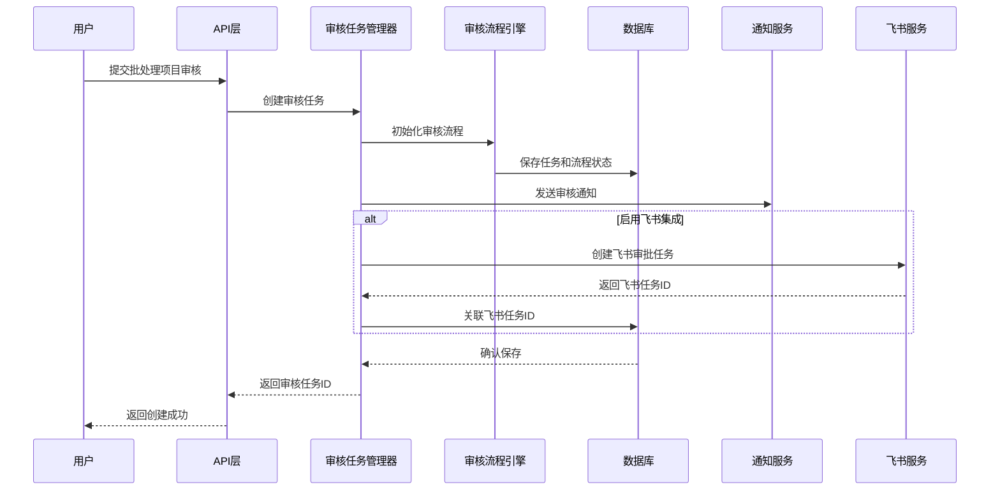
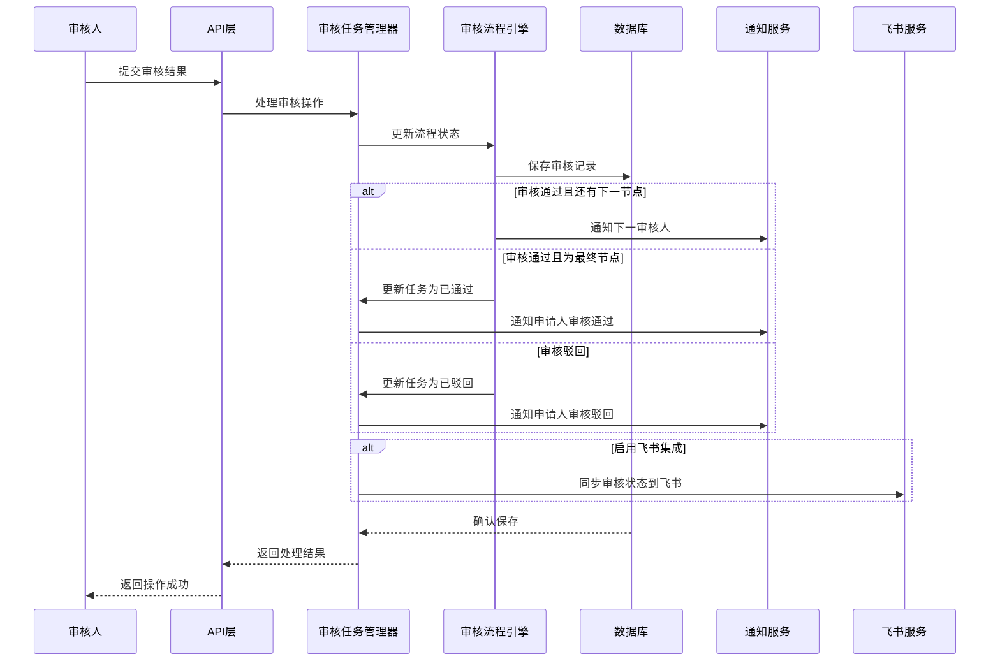

# 审核系统架构概要设计

## 1. 系统概述

审核系统是批量处理工作流的关键环节，为设计结果提供质量把控和多级审批流程。系统支持与飞书等平台集成，实现多角色协作的完整审核闭环，遵循Apple Human Interface Guidelines设计理念，提供高效直观的用户体验。

## 2. 架构设计

### 2.1 总体架构

```
审核系统架构
├── 应用层 (Application)
│   ├── 审核任务管理
│   ├── 审核流程引擎
│   ├── 标注服务
│   ├── 飞书集成服务
│   └── 通知服务
├── 领域层 (Domain)
│   ├── 审核任务聚合
│   ├── 审核流程聚合
│   ├── 审核项聚合
│   ├── 标注领域服务
│   └── 领域事件
├── 基础设施层 (Infrastructure)
│   ├── 持久化存储
│   ├── 缓存服务
│   ├── 消息队列
│   ├── 对象存储
│   └── 外部服务集成
└── 接口层 (Interfaces)
    ├── REST API
    ├── WebSocket通知
    ├── 集成Webhook
    └── 内部服务通信
```

### 2.2 技术栈选型

- **开发框架**: .NET 7 / ASP.NET Core
- **持久化**: Entity Framework Core + SQL Server
- **文档数据**: MongoDB (用于存储复杂标注数据)
- **缓存**: Redis
- **消息队列**: RabbitMQ
- **对象存储**: MinIO / OSS
- **认证授权**: JWT + Identity
- **外部集成**: 飞书开放API
- **部署环境**: Docker + Kubernetes
- **监控**: Application Insights + Prometheus

### 2.3 系统组件

#### 核心组件

1. **审核任务管理器**
   - 负责审核任务的创建、更新和状态管理
   - 实现审核任务与批处理项目的关联
   - 提供任务查询、过滤和分页功能

2. **审核流程引擎**
   - 处理多级审核流程配置和执行
   - 支持串行、并行和条件分支审核流程
   - 管理审核节点和转换规则

3. **标注服务**
   - 处理审核过程中的图形标注数据
   - 提供标注创建、更新和渲染功能
   - 支持多种标注类型(矩形、圆形、文本等)

4. **飞书集成服务**
   - 实现与飞书审批流程的双向同步
   - 处理审核任务与飞书任务的映射关系
   - 提供状态同步和评论同步功能

#### 支持组件

1. **通知服务**
   - 处理系统内部通知和外部消息推送
   - 支持多渠道通知(站内、邮件、飞书等)
   - 提供通知偏好设置和消息模板功能

2. **统计分析模块**
   - 审核效率和质量数据收集
   - 提供审核相关数据统计报表
   - 支持审核瓶颈和问题识别

## 3. 数据流设计

### 3.1 审核任务创建流程



### 3.2 审核流程执行流程



## 4. 数据存储概要

### 4.1 关系型存储 (SQL Server)

- **AuditFlow**: 审核流程定义表
- **AuditTask**: 审核任务主表
- **AuditItem**: 审核项表(与批处理项关联)
- **AuditRecord**: 审核记录表(记录每次审核行为)
- **AuditFeedback**: 审核反馈表(详细反馈内容)
- **ExternalIntegration**: 外部集成配置表
- **AuditNotification**: 审核通知表

### 4.2 文档型存储 (MongoDB)

- **Annotations**: 存储复杂的标注数据
- **AuditHistory**: 完整的审核历史记录
- **FeishuMappings**: 飞书映射关系数据

### 4.3 缓存策略 (Redis)

- 活跃审核任务缓存
- 审核配置缓存
- 用户权限缓存
- 审核统计数据缓存

## 5. 接口设计概要

### 5.1 RESTful API

- **/api/audit-tasks**: 审核任务CRUD接口
- **/api/audit-flows**: 审核流程管理接口
- **/api/annotations**: 标注管理接口
- **/api/integrations**: 外部集成管理接口

### 5.2 WebSocket

- 审核状态实时更新
- 评论和反馈实时通知
- 协同审核状态同步

### 5.3 内部服务接口

- 批处理服务集成接口
- 素材服务集成接口
- 用户服务集成接口

## 6. 扩展设计

### 6.1 多级审核流程

系统支持自定义复杂的多级审核流程，包括：
- 串行审核流程(一级一级审核)
- 并行审核流程(多人同时审核)
- 条件分支流程(基于条件的审核路径)
- 审核权重配置(不同审核人权重不同)

### 6.2 审核效率优化

- 批量审核功能
- 审核模板系统
- 智能预审核功能
- 快捷审核入口

### 6.3 集成扩展

除飞书外，系统设计预留了与其他平台集成的扩展点：
- 钉钉集成
- 企业微信集成
- Slack集成
- 邮件系统集成

## 7. 性能与扩展性

### 7.1 性能目标

- API平均响应时间 < 200ms
- 审核任务创建 < 500ms
- 标注操作实时响应 < 100ms
- 支持单日10000+审核任务处理

### 7.2 扩展性设计

- 微服务架构支持服务独立扩展
- 数据分区策略支持大规模数据
- 无状态设计支持水平扩展
- 缓存策略减轻数据库压力

## 8. 安全设计

### 8.1 访问控制

- 基于角色的访问控制(RBAC)
- 操作权限精细控制
- API访问令牌认证
- 审核数据访问控制

### 8.2 数据安全

- 敏感数据加密存储
- 审核记录不可篡改
- 操作日志完整记录
- 定期数据备份策略

## 9. 后续优化方向

- AI辅助审核功能
- 审核知识库建设
- 移动端审核体验优化
- 更丰富的数据可视化 